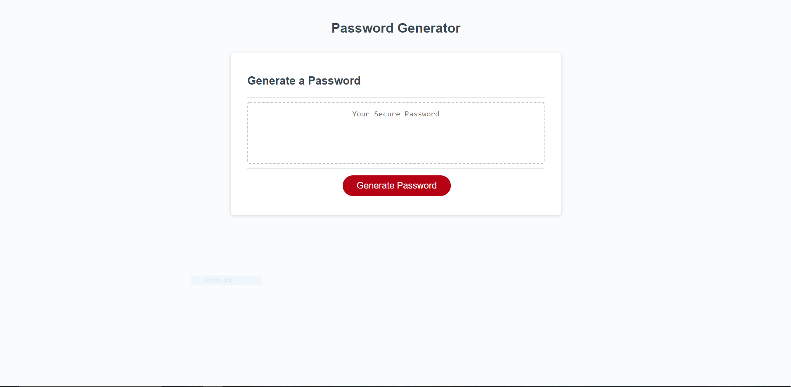
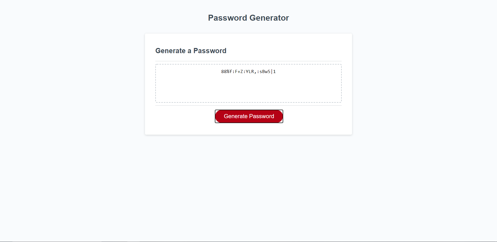

# password-generator

This is my password generator that operates after I added javascript to the webpage.

## Link to the website

My live deployment of this password generator is located here <https://eelektrick.github.io/password-generator/>

## My Journey with javescript for the password generator

Creating the foundation of the javascript was not to difficult, easily in a few hours had all my variables,
if and else statements, and the for loop started.

However I drew a blank on how to get the string of the different variables to come together and run through the for loop.
After alot of searching of stack over flow and through shared githubs I was able to find my answer and able to get a working password generator a few hours later.

## How to use the password generator

First you need to click on the generate button to bring up a prompt on how long of a password you want no less than 8 characters and no more than 128.

After that you will be given multiple prompts if you want to use lowercase, uppercase, symbols, and numbers in your password.

failing to choose at least one choice will cancel the process and start you back to the beginning.

After choosing how you want your password created the generator will spit out a random sequence of your choices to give you your desired result.